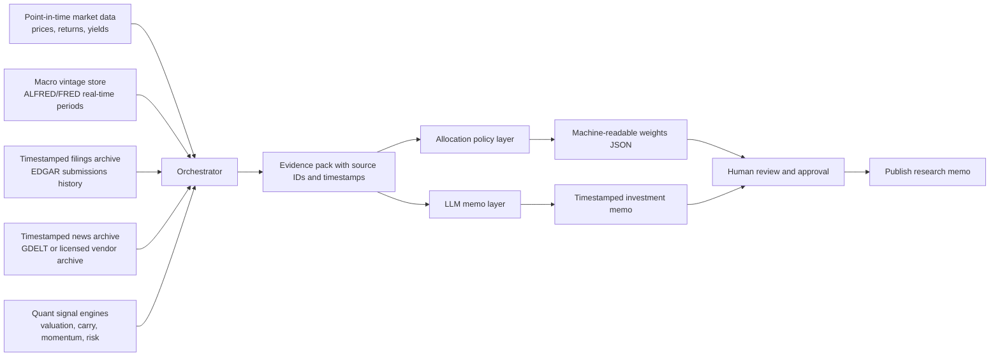
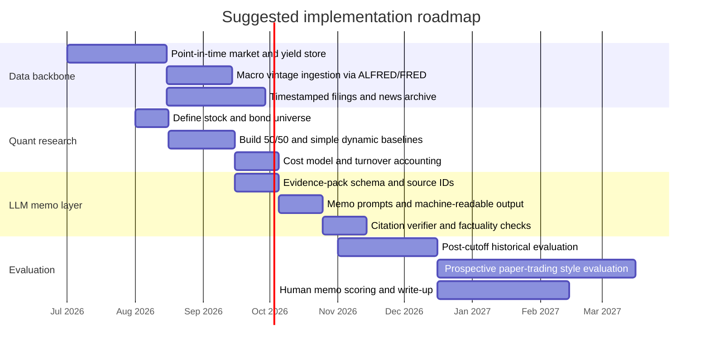

# Agentic LLM Systems for Dynamic Stock–Bond Allocation Memos

## Executive Summary

Your proposed project is academically defensible and practically interesting if it is framed as an **auditable decision-support system**, not as an autonomous allocator or trading agent. The strongest version of the idea is an agent that ingests **point-in-time quantitative signals, yields, macro vintages, timestamped news and filings, and explicit portfolio rules**, then produces two outputs at each decision date: a **timestamped investment memo with citations** and a **machine-readable stock/bond allocation**. In the literature I reviewed, that exact combination is still a gap: existing work clusters around either classic portfolio-allocation benchmarks, financial LLMs and agentic trading systems, or enterprise research copilots, but not around a rigorously timestamped, non-trading, memo-first stock–bond allocator. citeturn15academia5turn15academia6turn27academia0turn27academia1turn28academia0turn28academia1

The professor’s instinct to benchmark against **DeMiguel-style 1/N** is sound. In the uploaded DeMiguel paper, the abstract states that across **fourteen** portfolio-selection models and **seven** empirical datasets, none consistently outperformed **1/N** on **Sharpe ratio, certainty-equivalent return, and turnover**, and that the estimation window needed for sample mean–variance methods to beat 1/N can be implausibly long. For a two-asset stock/bond problem, the natural DeMiguel analogue is a **static 50/50 portfolio**, rebalanced on a fixed schedule. That is a hard, credible baseline because it is transparent, robust to estimation error, and difficult to beat after costs. [Uploaded DeMiguel et al. PDF, abstract, p. 2]

The biggest methodological issue is exactly the one you identified: **temporal leakage from pretrained LLMs**. Recent work in finance and agent evaluation shows that impressive backtests can be inflated when models implicitly “know the future,” and that search-based agents can also contaminate themselves at inference time by retrieving leaked benchmark answers or future-labeled material. The safest response is not to abandon evaluation, but to split it into a **historical post-cutoff track** and a **prospective track**, while forcing the LLM to operate only over a **point-in-time evidence pack**. citeturn7academia0turn7academia1turn7academia2turn7academia3

A serious evaluation should therefore have **two layers**. The first is the **economic layer**: out-of-sample return, volatility, Sharpe, certainty-equivalent return, drawdown, turnover, and cost-adjusted performance against 50/50 and other simple baselines. The second is the **memo layer**: citation accuracy, factual support, timeliness, consistency with the underlying evidence pack, and usefulness to human evaluators. Existing work in attributed generation and generative search shows that citation quality is not automatic, so memo scoring must explicitly audit whether claims are supported by the cited sources. citeturn17academia2turn17academia3turn28academia1turn27academia1

My overall judgment is favorable: this is a strong applied-research project **if the contribution is framed less as “LLM discovers alpha” and more as “LLM organizes admissible point-in-time evidence into a transparent allocation memo, under strict baselines and leakage controls.”** That framing makes the project more publishable, more defensible, and much easier to evaluate rigorously. citeturn7academia0turn17academia2turn38academia5

## What the Baseline Literature Implies for Your Design

DeMiguel et al. are the right anchor because they formalize a sobering point that remains central to your project: **estimation error can wipe out the theoretical gains of optimization**. In the uploaded paper, the abstract reports that none of the fourteen portfolio-choice models they study consistently beat 1/N out of sample on Sharpe ratio, certainty-equivalent return, or turnover, and that realistic estimation windows are often far too short for optimized portfolios to dominate the naive benchmark. [Uploaded DeMiguel et al. PDF, abstract, p. 2]

That matters even more in your case because your allocation universe is simpler than in the original DeMiguel setting. Once the universe is reduced to **stocks versus bonds**, the 1/N benchmark becomes a **50/50 benchmark**, and its interpretation becomes cleaner: any dynamic system must prove it can add value not merely over “some portfolio,” but over a fully transparent, low-turnover, low-complexity policy. The practical implication is that your paper should not use the LLM system’s surface sophistication as evidence of value. It should ask a narrower question: **can an evidence-constrained agent improve on simple stock/bond mixes after costs and with an auditable rationale?** [Uploaded DeMiguel et al. PDF, abstract, p. 2]

A related follow-up in the same line of research is the move from unconstrained optimization toward **constrained or regularized portfolio rules**, which aim to tame estimation error rather than solve it away. The literature around Raman Uppal’s portfolio work explicitly connects the 1/N result with later efforts such as norm-constrained optimization, emphasizing that the empirical problem is not the elegance of the optimizer but the fragility of the inputs. citeturn42search0

A second classical strand comes from the strategic-asset-allocation literature on **time-varying investment opportunities**, especially work associated with Campbell and Viceira. In other words, there is an established academic tradition for making stock/bond weights conditional on macro-financial state variables rather than treating allocation as static. Even where search retrieval was imperfect on the publisher pages, the strategic-allocation line is clear enough to motivate your project’s signal set: yields, term structure, macro state variables, and possibly valuation and volatility measures. citeturn4search0turn6search0

The real academic opportunity, then, is not to claim that the LLM supersedes this literature. It is to position the LLM layer as a **structured reporting and aggregation interface over a dynamic allocation process that is already grounded in classical asset-allocation signals**. That keeps the project inside a credible finance tradition while still being novel on the systems side. citeturn28academia0turn28academia2

## What Prior LLM and Agent Work Already Exists

There is already substantial work on **financial LLMs**, but much less on memo-first, stock/bond allocation agents. BloombergGPT is the clearest early institutional example of a finance-specialized foundation model: Bloomberg reports a **50B-parameter** model trained on **363B financial tokens** plus **345B general-purpose tokens**, with gains on financial tasks while preserving general performance. That is important as prior art for domain specialization, but it is still a foundation model paper rather than a timestamped portfolio-memo system. citeturn15academia5

On the open side, FinGPT explicitly argues for a **data-centric, open-source financial LLM pipeline** and describes automated data collection from **34 sources**, lightweight tuning methods, and applications including robo-advising and trading-related tasks. FinRobot extends that direction into an **agent platform** with financially specialized agents, layered architecture, and multi-source model integration. Both are highly relevant to your system architecture, especially if you want the academic contribution to stress transparent tooling and reproducibility rather than proprietary model strength. citeturn15academia6turn30academia6turn28academia0

The closest academic neighbors to your proposal are the recent **LLM-based financial agent** papers. FinMem introduces a trading agent with layered memory and interpretable decision modules and reports strong trading performance on a real-world financial dataset. TradingAgents goes further into **multi-agent specialization**, with distinct roles for fundamental, sentiment, technical, and risk teams, and evaluates the resulting system using cumulative return, Sharpe ratio, and maximum drawdown. These papers are useful because they show how the community currently evaluates finance agents, but they also reveal the gap in your favor: their center of gravity is **trading performance**, not **auditable non-trading memos with point-in-time citations**. citeturn27academia0turn27academia1

FinTeam is especially relevant on the **report-generation** side. It is a multi-agent system designed for comprehensive financial scenarios, including macroeconomic, industry, and company analysis, and it reports a **62% acceptance rate** in human evaluation, outperforming baseline models on that report-generation task. That is one of the better precedents for evaluating the memo itself, not just the downstream trading rule. citeturn28academia1

Two more papers matter for your retrieval layer. FinSeer proposes a **retrieval-augmented** framework specifically for financial time-series forecasting and reports an **8%** accuracy gain on BIGDATA22 over the base StockLLM. FinAgentBench, in turn, is valuable because it benchmarks **agentic retrieval in finance** using **3,429 expert-annotated examples** on S&P 100 firms. Together, they support the view that what often differentiates a useful financial agent is not just its language model, but its ability to retrieve the right evidence from the right corpus. citeturn28academia2turn28academia3

Industry products reinforce the same pattern. Reuters reports that AlphaSense is an AI-driven market-intelligence platform used to extract information from large collections of public and private financial content, while reporting around BloombergGPT describes it as an internal application for financial analysis. Public descriptions of products like FactSet Mercury point in the same direction: industry has moved aggressively into **research workflow acceleration**, search, summarization, and analyst productivity, but the publicly documented examples still look much more like **research copilots** than like fully auditable stock/bond memo agents. citeturn38news1turn38news0turn34search0

### Comparison of key prior works and projects

| Work or project | Year | Type | Core approach | Data or setup | Evaluation | Why it matters for your project |
|---|---:|---|---|---|---|---|
| DeMiguel et al. | 2009 | Finance benchmark | Compare optimized portfolio rules to naive diversification | 7 empirical datasets | Sharpe, certainty-equivalent return, turnover | Strongest baseline logic; 1/N is difficult to beat out of sample. [Uploaded DeMiguel et al. PDF, abstract, p. 2] |
| BloombergGPT | 2023 | Domain LLM | Finance-specialized 50B model | 363B finance tokens + 345B general tokens | Financial + general benchmarks | Shows value of domain adaptation, but not point-in-time memo generation. citeturn15academia5 |
| FinGPT | 2023 | Open financial LLM | Data-centric pipeline with lightweight tuning | 34-source internet-scale finance data pipeline | Multiple finance tasks and demos | Useful open baseline for financial text synthesis. citeturn15academia6turn30academia6 |
| FinMem | 2023 | Finance agent | Memory-based LLM trading agent | Real-world financial dataset | Trading performance comparison | Relevant architecture ideas, but goal is automated trading. citeturn27academia0 |
| FinRobot | 2024 | Agent platform | Multi-layer AI-agent platform for finance | Multi-source LLM and data stack | Demo platform and task decomposition | Good blueprint for modular agent design. citeturn28academia0 |
| TradingAgents | 2024 | Multi-agent trading | Specialized analyst and risk agents | Stock-trading backtests | Return, Sharpe, max drawdown | Closest multi-agent analogue; still trading-centered. citeturn27academia1 |
| FinTeam | 2025 | Multi-agent report generation | Analyst, accountant, consultant agent workflow | Real investment-forum tasks | Human acceptance rate | Strong precedent for evaluating memo/report quality directly. citeturn28academia1 |
| FinSeer | 2025 | Financial RAG | Retrieval-augmented time-series forecasting | Financial indicators + historical prices | Accuracy on BIGDATA22 | Supports retrieval-first design for finance agents. citeturn28academia2 |
| FinAgentBench | 2025 | Benchmark | Agentic retrieval benchmark for finance | 3,429 expert-annotated S&P 100 examples | Retrieval reasoning evaluation | Helpful for evaluating your evidence layer separately from allocation. citeturn28academia3 |
| Profit Mirage | 2025 | Evaluation methodology | Leakage-robust benchmark for LLM finance agents | FinLake-Bench | Out-of-sample generalization after cutoff | Directly supports your concern about temporal leakage. citeturn7academia0 |

## Temporal Leakage, Point-in-Time Retrieval, and Why Ordinary Backtests Break

Your concern about backtesting with LLMs is well founded. The most relevant paper I found is **Profit Mirage**, which argues that many LLM-based financial agents exhibit eye-catching backtested returns that disappear once the model’s knowledge window ends. The paper frames this as an **inherent information-leakage problem** and proposes a leakage-robust benchmark, FinLake-Bench, precisely because standard historical backtests can be systematically overstated when the model has latent access to later facts. citeturn7academia0

The problem is broader than pretraining alone. A separate line of work on **search-time contamination** shows that search-based agents can leak evaluation answers at inference time by retrieving benchmark artifacts or question-answer pairs from the public web. One such study finds that on contaminated subsets, blocking HuggingFace causes about a **15%** accuracy drop, and a newer deep-research-agent study reports that contamination can inflate results by up to **4%** and recommends isolated sandboxes, transparent search traces, and controlled benchmark access. citeturn7academia1turn7academia2

That means a historically fair finance evaluation needs **two protections at once**. First, the model itself must not have a knowledge cutoff later than the data period being evaluated, unless the evaluation explicitly treats the model as a post-cutoff system. Second, the model must not browse an unrestricted web during historical testing, because even a perfectly frozen model can still leak through retrieval. AntiLeak-Bench reinforces this logic by advocating evaluation on explicitly **new knowledge** absent from the model’s training set. citeturn7academia3

The practical solution is a **point-in-time evidence architecture**. On the macro side, ALFRED exists precisely for this purpose: the St. Louis Fed says ALFRED lets you retrieve the vintage that was available on a specific historical date, and the FRED API formalizes this with **realtime_start** and **realtime_end** parameters and with **series vintagedates**, which return the dates when observations changed. On the filings side, SEC EDGAR provides **real-time filings**, date filtering, and APIs with submissions history. On the news side, GDELT maintains historical archives going back to **1979** and updates every **15 minutes**, with archival preservation of monitored online news. citeturn10view0turn10view1turn11view3turn11view1turn13view0

A good historical protocol therefore looks like this: at decision date *t*, the system can only access a **sealed evidence pack** containing market data, macro vintages, filings, and news that were actually available at or before *t*; the LLM is forbidden from open-web browsing; and the final memo must cite only those objects. This is not merely a data-engineering preference. It is the single most important design choice if you want your backtest to mean what readers think it means. citeturn7academia0turn7academia1turn7academia2turn10view1turn13view0

The citation requirement is equally important. Work on generative search verifiability finds that only **51.5%** of generated sentences were fully supported by citations and that only **74.5%** of citations actually supported the associated sentence. A newer audit finds evidence that around **16%** of cited sources in generative-search responses were themselves AI-generated. In other words, merely asking for citations is not enough. Your system needs a **citation verifier** that checks each memo claim against the underlying evidence pack before release. citeturn17academia2turn30academia5

## Evaluation Design for a Non-Trading Memo Agent

The cleanest design is to evaluate the system as **two linked but separable objects**: an allocation policy and a reporting policy. The allocation policy is the stock/bond weight vector. The reporting policy is the memo explaining that vector. Those two layers should be tested separately before they are tested together. That decomposition is consistent with the financial-agent literature, which often mixes signal retrieval, reasoning, and portfolio decisions into one score, and with attributed-generation research, which shows that retrieval and citation quality deserve standalone evaluation. citeturn27academia1turn28academia3turn17academia2turn17academia3

For the **economic layer**, I would treat **monthly rebalancing** as the default unless you specify otherwise; **quarterly** is also common and may reduce turnover. The minimum baseline set should include a static **50/50**, a static **60/40**, **stocks only**, **bonds only**, a **risk-parity or volatility-targeted two-asset rule**, and at least one **simple predictive dynamic rule** based on the same state variables the agent sees. Those comparisons are essential because otherwise any outperformance over 50/50 could simply be repackaging of obvious duration or equity-timing rules. The anchor metrics should be the same ones emphasized by DeMiguel—Sharpe, certainty-equivalent return, and turnover—augmented with drawdown and cost-adjusted return, because recent finance-agent papers also report drawdown-based risk metrics. [Uploaded DeMiguel et al. PDF, abstract, p. 2] citeturn27academia1

For the **memo layer**, I would score each memo along five dimensions: factual support, timeliness, completeness of economic reasoning, internal consistency with the machine-readable weights, and usefulness to a human judge. FinTeam’s human acceptance-rate design is the best directly relevant precedent I found. On top of that, you can import ideas from attributed generation and generative-search evaluation by calculating **citation precision** and **citation recall** over memo claims. citeturn28academia1turn17academia2turn17academia3

A particularly strong experiment is to compare three system variants. In the first, the **quant model chooses the weights** and the LLM only writes the memo. In the second, the LLM chooses among a **small discrete set of allocation buckets** such as 20/80, 40/60, 50/50, 60/40, and 80/20. In the third, the LLM outputs a **continuous weight**. If performance deteriorates as discretion increases, that will be a useful result: it would suggest that the LLM belongs in the reporting and bucket-selection layer, not in full continuous allocation. That would also be consistent with DeMiguel’s core lesson about overfitting and fragile optimization. [Uploaded DeMiguel et al. PDF, abstract, p. 2]

If you want a publishable causal angle, the most compelling comparison is not simply “agent versus 50/50.” It is **same evidence, same quantitative inputs, different decision layer**. For example, compare: a fixed rule using the quant signals; a template-based memo with that rule’s output; and an LLM-generated memo plus LLM-chosen allocation bucket using the same evidence pack. That isolates whether the LLM adds value as a summarizer, as a classifier over regimes, or not at all. citeturn28academia0turn28academia2turn17academia2

## Model Choice, Reproducibility, and Governance

For your use case, model choice should be driven less by leaderboard prestige and more by **cutoff clarity, release date, open-weight availability, and stability across repeated rebalances**. Meta’s Llama 3.1 model card is valuable here because it states a **December 2023** knowledge cutoff and explicitly labels the model as a **static model trained on an offline dataset**. That makes Llama 3.1 a strong candidate for historical experiments beginning after that cutoff, especially if you need reproducibility and the ability to rerun the exact checkpoint. citeturn26view0turn26view1

Anthropic’s Claude 3.5 Sonnet is attractive if you want a strong closed model with documented cutoff and agentic capability. Anthropic’s model-card addendum states an **April 2024** knowledge cutoff for the upgraded Claude 3.5 Sonnet, and the same document reports strong internal **agentic coding** performance. That does not make it the best finance model automatically, but it does make it a plausible memo-writing baseline for a post-April-2024 prospective or semi-prospective setting. The trade-off is weaker reproducibility, because a hosted API is not the same thing as a frozen open-weight checkpoint. citeturn25view0turn25view3

If you specifically want an **open reasoning model**, DeepSeek-R1 is the clearest milestone in the retrieved sources. Its release materials describe it as a first-generation reasoning model, and the repository explains that DeepSeek-R1-Zero used large-scale reinforcement learning without supervised fine-tuning as a preliminary step, while DeepSeek-R1 added cold-start data before RL and was released together with distilled open models based on Llama and Qwen. That makes R1 or an R1-distill checkpoint a strong candidate for the “reasoning-enabled open model” condition in your experiments. The downside is timing: because the release is in **January 2025**, it gives you a shorter historical window than Llama 3.1. citeturn23view0turn24view1turn24view2turn24view3

The reproducibility hierarchy is therefore fairly clear. For the **historical, leakage-sensitive** part of the paper, prefer **open-weight static checkpoints** with documented cutoffs. For the **prospective or current-operations** part, you can add closed frontier models as a separate, clearly labeled robustness test. OpenAI’s model documentation illustrates why that separation matters: current API models come with explicit knowledge cutoffs and tool support, but they also live inside a provider-managed model catalog with deprecations and lifecycle changes. That is appropriate for operations, but much less clean for archival backtests. citeturn20view0

On governance, the best available survey source emphasizes **explainability, adversarial testing, auditability, and human oversight** as central best practices for generative AI in financial institutions. I would treat those as non-negotiable design constraints. Preserve the full retrieved evidence pack, the prompts, the model version, the generation settings, and the final memo. Require human sign-off before any memo is distributed. And keep the system explicitly **non-trading**, with no execution pathway in the architecture. citeturn38academia5

There is also an intellectual-property and content-rights angle. Reuters reports that Bloomberg described BloombergGPT in litigation as an internal application for financial analysis, in the context of a broader copyright dispute over AI training data. Regardless of the merits of that case, it is a reminder that **licensed access to news, research, and filings matters**, especially if your system will store, retrieve, and summarize third-party content at scale. citeturn38news0

## Recommended Research Design and Roadmap

The highest-confidence research design is this: treat the project as a **point-in-time evidence system with an LLM memo layer and a constrained allocation layer**, benchmark it against **50/50 and other simple baselines**, and evaluate it in **both post-cutoff historical data and genuinely prospective data**. That design directly addresses DeMiguel’s estimation-error critique, the temporal-leakage critique from Profit Mirage, and the citation/verifiability critique from generative-search evaluation. [Uploaded DeMiguel et al. PDF, abstract, p. 2] citeturn7academia0turn17academia2

I would implement the project in four stages. First, build the **data backbone**: point-in-time prices, yields, macro vintages, and timestamped news/filings. Second, build and lock the **quant baselines** before the LLM writes anything. Third, add the **memo layer** with hard citation constraints and a verifier. Fourth, run **post-cutoff historical** and then **prospective** evaluations. The critical principle is that the economic allocation logic must exist independently of the prose layer, so that you can tell whether the LLM improves decision quality, communication quality, or neither. citeturn10view1turn11view1turn13view0turn28academia2turn17academia2

In paper form, I would present three main hypotheses. The first is that **simple baselines remain unusually difficult to beat** in two-asset allocation. The second is that **strict point-in-time retrieval materially lowers apparent backtest performance** relative to naive LLM backtests. The third is that **LLMs add more value as reporting and evidence-integration layers than as unconstrained allocators**. Each hypothesis is testable with the architecture above and maps neatly to the prior literature you cited and the leakage literature you were worried about. [Uploaded DeMiguel et al. PDF, abstract, p. 2] citeturn7academia0turn28academia1turn17academia2

## Open Questions and Limitations

The strongest limitation in the retrieved literature is that I did **not** find a primary-source paper that exactly matches your target system: a **non-trading, point-in-time, citation-constrained LLM agent for stock–bond allocation memos that also outputs weights**. The nearest neighbors are finance agents focused on trading, financial report-generation systems, and enterprise research copilots. That is a limitation of the prior art, but it is also your opening. citeturn27academia0turn27academia1turn28academia1turn38news1

A second limitation is that some classic finance follow-up papers around 1/N and dynamic allocation were easier to confirm by title and research lineage than by directly retrievable publisher abstracts in the available web search results. The DeMiguel baseline itself is secure from the uploaded paper, but a fuller library-database pass could deepen the classic-finance section. [Uploaded DeMiguel et al. PDF, abstract, p. 2]

A final limitation is regulatory scope. The governance literature strongly supports explainability, auditability, and human oversight, but the exact legal perimeter of a memo system depends on jurisdiction, distribution method, compensation structure, and whether the output is individualized. So the safest product framing remains: **research support, not execution; human approval required; provenance and limitations disclosed on every memo**. citeturn38academia5turn38news0